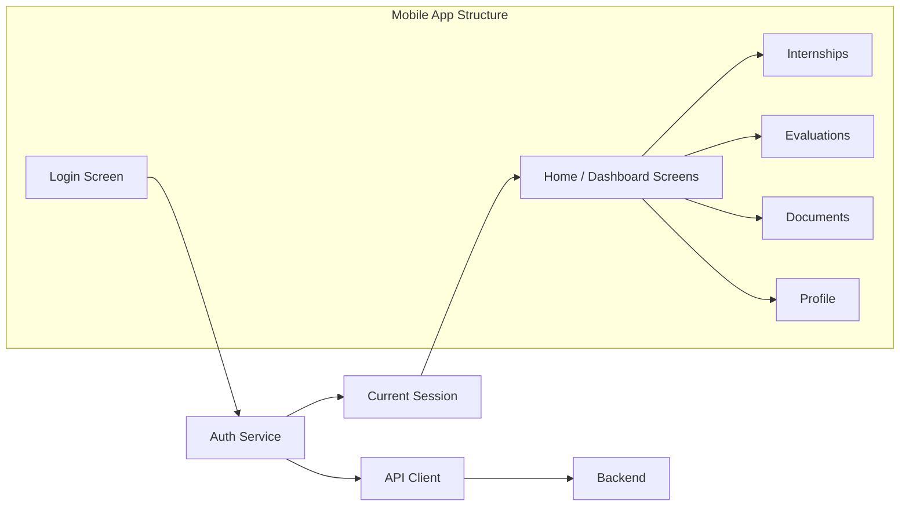

# Internship Mobile App

This mobile app is the student-facing portal for the Internship Management System. It is built with Expo, React Native, and Expo Router, and is focused on student login, internship opportunities, internship status tracking, evaluation viewing, document downloads, notifications, and profile management.

---

## Folder Structure

### `app/`

Contains all app screens and the router configuration.

- `_layout.jsx` — root layout with `ThemeProvider` and all app screens registered.
- `index.jsx` — login screen for student authentication.
- `home.jsx` — dashboard screen showing internship summary, feedback snapshot, and payment status.
- `internships.jsx` — browsing internship opportunities, saving favorites, and applying with file uploads.
- `status.jsx` — detailed internship status and current placement progress.
- `evaluations.jsx` — list of submitted evaluations with downloadable assessment and attendance documents.
- `documents.jsx` — UIL recommendation letter viewer and download page.
- `notifications.jsx` — feedback messages from company mentors and faculty mentors.
- `profile.jsx` — student profile, theme toggle, logout, and skill update screen.

### `components/`

Reusable UI building blocks.

- `common/` — common layout components used across screens, e.g. `Screen`, `Loader`, `EmptyState`.
- `home/` — home-specific cards like `Header`, `StatusCard`, `ReportCard`.
- `ui/` — generic UI primitives such as `Button`, `Card`, `InputField`, `Badge`.

### `providers/`

- `ThemeProvider.jsx` — manages theme state and status bar style using `nativewind` and Expo.

### `services/`

API abstraction layer for communication with the backend.

- `apiClient.js` — HTTP request wrapper, API base URL detection, auth token handling, timeout handling.
- `authService.js` — login, logout, session state, first-login password flow.
- `studentService.js` — all student-related backend endpoints (internships, profile, evaluations, feedback, documents, payment, applications).

### `utils/`

Utility helpers and file upload support.

- `dateFormat.js` — date formatting helpers used across screens.
- `documentUpload.js` — PDF picker and `FormData` helper for uploads.
- `internshipProgress.js` — computes internship progress and active/dormant state.

### Other important files

- `app.json` — Expo app configuration.
- `package.json` — project dependencies and scripts.
- `babel.config.js`, `metro.config.js`, `tailwind.config.js`, `postcss.config.mjs` — build and styling setup.
- `global.css` — global styles for the app.

---

## Full App Functionality

### 1. Student Login

- `app/index.jsx` provides a login form using `identifier` and `password`.
- On success, it stores the auth token in `authService.js`.
- If `firstLogin` is true, the user is redirected to a password change flow.
- Sample login logic:

```js
login({ identifier, password }).then((result) => {
  if (result.firstLogin) {
    router.replace("/change-password");
    return;
  }
  router.replace("/home");
});
```

### 2. Home Dashboard

- `app/home.jsx` loads:
  - current internship and applications
  - evaluation feedbacks
  - payment application status
- It shows internship status and a summary card, plus buttons to open status details.
- If an internship is active, it renders company, mentor, and progress details.

### 3. Internship Opportunities

- `app/internships.jsx` displays internship listings and suggested matches.
- Students can save internships, view details, and apply.
- Applying requires selecting two PDF files: CV and academic document.
- Upload is handled through `documentUpload.js`:

```js
const file = await pickPdfDocument();
formData.append("cv", {
  uri: asset.uri,
  name: asset.name || "cv.pdf",
  type: asset.mimeType || "application/pdf",
});
```

### 4. Internship Status

- `app/status.jsx` shows in-depth status data from the current placement.
- It displays company mentor, faculty mentor, location, progress bar, and application timeline.
- Progress is calculated by `utils/internshipProgress.js`.

### 5. Evaluations

- `app/evaluations.jsx` lists internship evaluations.
- Each evaluation may include:
  - assessment PDF link
  - attendance PDF link
  - total mark
  - publishing date
- Sample document open logic:

```js
function openDocument(fileUrl) {
  if (!fileUrl) {
    Alert.alert("Unavailable", "This file has not been uploaded yet.");
    return;
  }
  Linking.openURL(fileUrl);
}
```

### 6. Documents

- `app/documents.jsx` checks for the student recommendation letter issued by UIL.
- If available, the app shows `View` and `Download` actions.

### 7. Notifications & Feedback

- `app/notifications.jsx` loads feedback from company and faculty mentors.
- Feedback entries are grouped into:
  - company mentor feedback
  - faculty mentor feedback
- Each item can include:
  - `overall_comment`
  - `strengths`
  - `weaknesses`
  - `suggestions`
  - `rating` (stars)
- The app uses `getStudentFeedbacks()` from `services/studentService.js`.

### 8. Profile Management

- `app/profile.jsx` loads the student profile and allows skill updates.
- It supports:
  - viewing personal and academic details
  - toggling light/dark theme
  - logging out
  - updating skill list
- Profile updates call `updateStudentProfile()`.

---

## What Evaluators Provide

This app does not contain evaluator question forms inside the mobile client. Instead, evaluators and company mentors submit evaluation data on the backend, and the mobile app displays it.

The student app shows evaluator feedback such as:

- `overall_comment`
- `strengths`
- `weaknesses`
- `suggestions`
- numeric `rating`
- assessment PDF uploads
- attendance PDF uploads

That means an evaluator can answer questions such as:

- What did the intern do well?
- What areas need improvement?
- What are the intern’s strengths and weaknesses?
- Is the intern meeting attendance requirements?
- What overall mark should the intern receive?

The mobile app reads and displays those evaluation records from the backend.

---

## Key API and Service Code

### `services/apiClient.js`

- Detects backend host automatically for Expo.
- Adds auth token to requests when required.
- Handles JSON and `FormData` uploads.

### `services/authService.js`

- `login()` authenticates and saves the session token.
- `logout()` clears the token.
- `getCurrentSession()` returns current user data.

### `services/studentService.js`

Main endpoints used by screens:

- `getStudentInternships()`
- `getSuggestedInternships()`
- `getMyInternship()`
- `getStudentEvaluations()`
- `getStudentFeedbacks()`
- `getRecommendationLetter()`
- `applyForInternship()`
- `submitPaymentForm()`

Example endpoint usage:

```js
export function getStudentEvaluations() {
  return apiRequest("/api/student/evaluations", {
    requiresAuth: true,
  });
}
```

### `utils/documentUpload.js`

- `pickPdfDocument()` opens the Expo document picker for PDF selection.
- `appendAssetToFormData()` attaches PDF files to `FormData` for uploads.

---

## Run the Mobile App

From `Mobile-App/`:

```bash
npm install
npx expo start
```

Then choose one of:

- Android emulator
- iOS simulator
- Expo Go
- web preview

> Important: The mobile app expects the backend server to be reachable from your device or emulator. In Android emulators it uses `http://10.0.2.2:5000`, and on iOS/simulator it uses `http://localhost:5000` by default.

---

## Developer Quick Start

If you are working on the mobile app source, use this section as a fast onboarding guide.

1. Open the `Mobile-App` folder in your editor.
2. Install dependencies:

```bash
npm install
```

3. Start Expo:

```bash
npx expo start
```

4. Run the app on your target platform:

- Android emulator: choose `android`
- iOS simulator: choose `ios`
- Expo Go: scan the QR code from the Expo CLI
- Web preview: choose `web`

5. Set the backend URL if needed in the Expo environment or use the default host detection logic in `services/apiClient.js`.

6. Update UI and screens in `app/`.

7. For PDF uploads, inspect `utils/documentUpload.js` and the `applyForInternship` form logic in `app/internships.jsx`.

---

## Architecture Diagram

The mobile app follows a layered architecture:

- `app/` contains screen-level pages and routing.
- `components/` contains reusable UI building blocks.
- `providers/` contains global context providers like theme handling.
- `services/` contains API and auth service wrappers.
- `utils/` contains shared utilities for formatting, progress state, and file uploads.



---

## Notes

- The app is designed for student accounts only.
- It uses Expo Router for navigation and `nativewind` for styling.
- Authentication state is kept in memory in `authService.js`; the app does not currently persist login across reloads.
- File uploads are currently limited to PDF documents.

I can also add a brief “backend connection setup” subsection or diagram labels for each screen.
